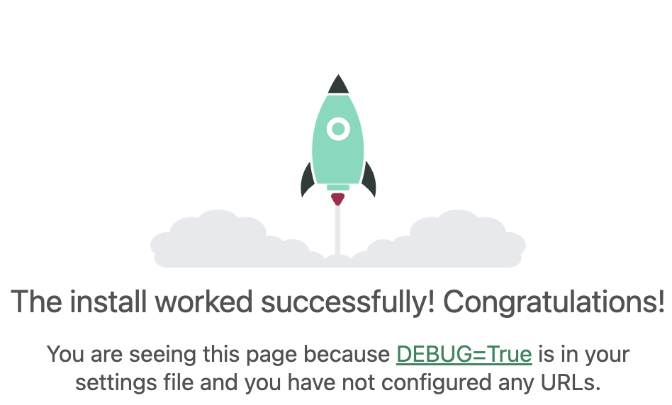

# Week 1 - What is Backend Web Development?

## Terms to Know

**HTTP** HyperText Transfer Protocol 
- You can think of this as the language that computers use to talk to one another on the internet. Your web browser makes HTTP requests to a server and then gets an HTTP response from a server. The content of the HTTP response is usually an html web page.

**HTML** HyperText Markup Language
- HTML is a markup language (not a programming language) that describes to a web browser the content, structure, and formatting of a web page. Unlike a programming language it contains no logic, just the contents and description of those contents.

**CSS** Cascading Style Sheets
- CSS describes the formatting of the web page (color, fonts, spacing, anything else you can imagine)

**Javascript**
- Javascript is the smarts in websites, and is used to add interactive features


## What Happens You go to a Website? or How the internet works

1. A web browser is nothing more than a program that reads html, css, and javascript and executes them.
1. You open your web browser and navigate to a website.
1. The web browser requests the html, css, and javascript from a server (another computer somewhere) using an HTTP GET request.
1. The server sends an HTTP response, the web browser receives this content and renders it for you to see.

```mermaid
sequenceDiagram
    PC Web Browser->>Web Server: Hello, can I have a web page?
    Web Server-->>PC Web Browser: Sure! Here it is!
```

- What do backend web servers do?
- What is Django? Who uses it? Why Django? What other options are there?
- Install VSCode, kolo, django, sqlite viewer

# Our first Django App

## Install Django

```bash
pip install django
python -m django startproject webdev_examples
python ./webdev_examples/manage.py runserver
```

Open a web browser and go to the web address 127.0.0.1:8000

You should see the following:


## Understanding what is Happening - Kolo

```bash
pip install kolo
```


1. Install the kolo extension in VS Code

1. Open the file settings.py (created by `django startproject`)
1. Find the section that looks like the below
```python
MIDDLEWARE = [
    'django.middleware.security.SecurityMiddleware',
    'django.contrib.sessions.middleware.SessionMiddleware',
    'django.middleware.common.CommonMiddleware',
    'django.middleware.csrf.CsrfViewMiddleware',
    'django.contrib.auth.middleware.AuthenticationMiddleware',
    'django.contrib.messages.middleware.MessageMiddleware',
    'django.middleware.clickjacking.XFrameOptionsMiddleware',
    'kolo.middleware.KoloMiddleware',
]
```
3. Add the line `'kolo.iddleware.KoloMiddleware'`

1. Stop (Ctrl-C) and restart (`python manage.py runserver`) the django server
1. Refresh the web browser page for 127.0.0.1
1. Go to VS Code and click on the Kolo Icon, and select "Response"


