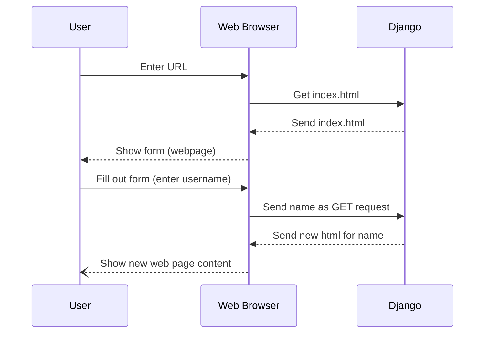

# Week 4 - Forms

## What is a form?

Unless you’re planning to build websites and applications that do nothing but publish content, and don’t accept input from your visitors, you’re going to need to understand and use forms.[^1]

HTML Forms are all the interactive bits on web pages, e.g. the search box on the google home page, or the text fields to enter your user name and password. Even the add to cart button on a shopping site. 

## Quick Review of Forms

A form is a collection of html tags that starts with `<form>` and ends with `</form>`. Usually inside the form are one or more `<input>` tags. 

There are several types of input tags. The most common are shown below. 

The `<input>` tag has a **required** attribute, `type=`. The `type` attribute can be set to any of the following:
- `text` - A single line text box
- `password` - A single line text box, but all characters show up as dots when the users enters typed characters.
- `radio` - A radio button, only one button in a radio button group can be selected at a time
- `checkbox` - A checkbox, similar to a radio, but multiple checkboxes can be selected at once
- `file` - lets the user select a file (looks like a single line text box with a "browse" button next to it)
- `submit` - Creates a button that submits the form to a web server. ~~We won't be covering that in this class. But maybe next semester.~~ **Welcome to next semester! :)**

Lastly, for radio buttons you will want to use the `name` attribute as it makes it so that you can only select ONE radio buttons of all the radio buttons that have the same name.

```html
<h4>Places to Go</h4>
<form>
    <input type="checkbox">Italy</input><br/>
    <input type="checkbox">Canada</input><br/>
    <input type="checkbox">Uruguay</input><br>
    <input type="checkbox">Lithia</input>
</form>
```

<h4>Places to Go</h4>
<form>
    <input type="checkbox">Italy</input><br/>
    <input type="checkbox">Canada</input><br/>
    <input type="checkbox">Uruguay</input><br>
    <input type="checkbox">Lithia</input>
</form>


```html
<h4>Vote for Lithian President</h4>
<form>
    <input type="radio" name="vote">Elizabeth Laws</input>
    <br>
    <input type="radio" name="vote">Donald Duck</input>
    <br>
    <input type="radio" name="vote">
        Write-In:
        <input type="text"></input>
    </input>
    <input type=submit>
</form>
```

<h4>Vote for Lithian President</h4>
<form>
    <input type="radio" name="vote">Elizabeth Laws</input>
    <br>
    <input type="radio" name="vote">Donald Duck</input>
    <br>
    <input type="radio" name="vote">
        Write-In:
        <input type="text"></input>
    </input>
    <br>
    <input type=submit>
</form>

## How form data gets to Django

Form data is sent from the web page to the web server as either a GET request OR a POST request. 
The difference is pretty simple

- GET (as we saw last week) puts the data into the url via query parameters (i.e. `?<param>=<value>`). Django reads the GET data with request.GET

- POST data is invisible to the user but it sent via HTTP. Certain things like passwords (sensitive  information) should only be sent via POST and not GET. Django reads POST data with request.POST

- GET is often convenient for things that the user may want to bookmark or share a link to. There is no way to share a link for POST data, but a URL containing a search query can be shared

## Example 1 - Hello Forms!

Let's have a form get the user's name, and then render a hello page with that name.



1. Edit index.html and replace everything inside the `<body>` tag with the below code

    ```html
    <form action="/hello" method="get">
        <label for="user_name">Your name:</label>
        <input> id="user_name" type="text" name="Your Name:" value="World">
        <input type="submit">
    </form>
    ```

which will appear as below:
<form action="/name" method="get">
    <label for="user_name">Your name:</label>
    <input id="user_name" type="text" name="Your Name:" value="World">
    <br>
    <input type="submit">
</form>

2. 
[^1]: https://docs.djangoproject.com/en/5.1/topics/forms/
